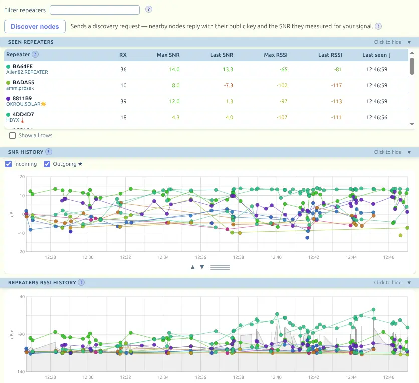
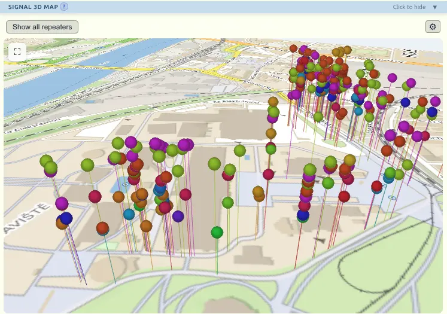
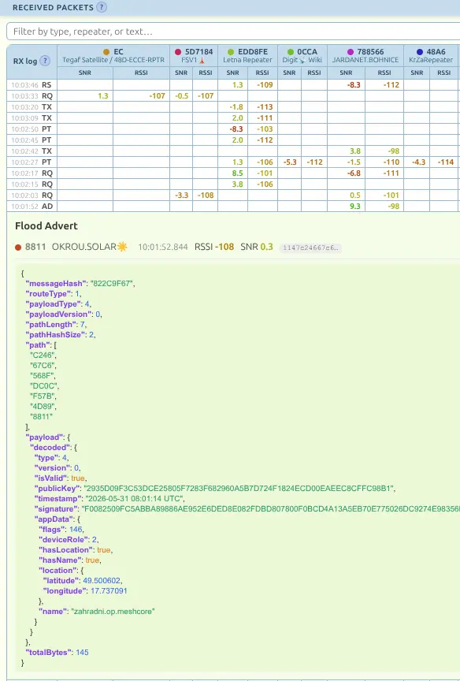

# MeshCore Signal Tester

Web application for real-time monitoring of LoRa mesh traffic from a MeshCore **companion radio** (Bluetooth, USB, or — in the Android app — WiFi) or a MeshCore **repeater** (USB serial CLI). The connected device type is auto-detected.

### Live app: [meshcore.kyblsoft.cz/signal-tester](https://meshcore.kyblsoft.cz/signal-tester)
#### Android app available in [repo releases](https://github.com/kybl/meshcore-signal-tester/releases).

## Features

- **Connection** — connects to a MeshCore companion device over **Bluetooth** (Web Bluetooth) or **USB serial** (Web Serial); previously used devices appear as one-click reconnect buttons (USB ports are labelled by vendor/product id, since serial ports expose no name). The **Android app** adds a **WiFi** option — a raw TCP link to a companion running the WiFi firmware (same frame protocol as USB serial) — which browsers can't provide; you enter the device's IP and port, and the connection is saved for one-click reconnect too
- **Repeater support (USB)** — also connects to a MeshCore repeater, which exposes a plain-text CLI instead of the binary protocol; the device type (companion vs repeater) is auto-detected on connect. On stock firmware the app polls the packet log and neighbour table; on a `MESH_PACKET_LOGGING` build it decodes the live raw packet stream for full per-packet detail. See [Device detection](#device-detection)
- **Packet grouping** — groups every reception by message, so you can see at a glance which repeaters forwarded the same packet and compare their signal side by side. Packets are decoded with `@michaelhart/meshcore-decoder` (type, path, last-hop repeater IDs, RSSI, SNR, payload fields) to drive the grouping and labelling
- **Seen repeaters table** — per-repeater statistics (RX count, max/last RSSI, max/last SNR, last seen); sortable columns
- **SNR & RSSI history charts** — scrolling time-series per repeater with noise floor estimate; click a chart dot to highlight one repeater across all views; **zoom and pan the time axis** (mouse wheel, drag across a region, or pinch — both charts share one time window; double-click or **Reset zoom** to restore)
- **Signal 3D map** — places each received packet as a dot at your GPS position; height encodes SNR (taller = higher SNR); click a dot to select a repeater, turn the camera toward a repeater whose position is known, keep repeaters pinned on the map, or follow your own location as you move (**Center on me** toggles follow mode — any manual pan/rotate leaves it); while capturing live, the map keeps tiles loaded around your current position so you don't move off the map even when no packets are arriving (an imported dataset from elsewhere is left in place); map tile sources: Mapy.com (basic/outdoor/aerial/winter), OpenStreetMap and variants (OpenTopoMap, CyclOSM, Humanitarian, German, French), CARTO (Dark Matter / Positron / Voyager, each also without labels), Esri (Dark/Light Gray Canvas and World Imagery satellite), or **None** for a plain floor; in dark mode the area around the map is black
- **Discover nodes** — sends an active discovery request; nearby nodes (firmware ≥ v1.10) reply with their public key, name, GPS position, and the SNR they measured for your uplink
- **Received packets table** — one row per unique packet hash, one column pair (RSSI/SNR) per repeater; click a cell to expand full packet detail with ms-precision reception time and raw hex; filterable
- **CSV import / export** — export the captured packets to a CSV file and re-import them later to review offline; contact metadata is embedded so repeater names and positions survive the round-trip; export covers the full on-disk history, not just what is in memory
- **Persistent capture** — the session is written to on-disk storage (IndexedDB) as it is captured, so it survives a page reload or app restart (you're asked whether to resume the previous session on launch), and *Auto-remove: Never* keeps the whole history without growing memory without bound. Storage is isolated per browser tab
- **Repeater ID prefix resolution** — path IDs can arrive as 1–3-byte prefixes of full 4-byte node IDs; the app progressively promotes shorter labels to longer ones, and splits columns into collision labels (e.g. `1234/1289`) when an ID turns out to be ambiguous
- **Pause / Resume** — suspend data collection without disconnecting; collection pauses automatically on disconnect and resumes on reconnect
- **Sound** — optional two-tone beep on each new packet (off / short / medium / long); first tone is a fixed 700 Hz click, second tone pitch scales with SNR (0 dB = base, ±10 dB = ±1 octave); when a repeater filter is active, only the filtered repeater(s) trigger sound; setting persisted in localStorage
- **Auto-remove** — permanently deletes captured data older than a chosen window (30 s … 12 h, or **Never** — the default); packets, signal history, Seen Repeaters and 3D-map points all expire together, and collision labels are recalculated as their evidence ages out. Setting persisted in localStorage
- **Display window** — separate from Auto-remove: controls how far back each view (table, charts, 3D map) shows, *without* deleting anything (30 s … 12 h, or **All**); defaults to 15 min and can be set no longer than Auto-remove. Persisted in localStorage
- **Repeater filter** — comma-separated prefix filter that applies to all sections simultaneously (table, charts, map)
- **Keep screen on** — optional toggle (default on) that prevents the screen from sleeping while collecting data; persisted in localStorage
- **Device battery** — displays the connected device's battery level, derived from the voltage it reports (MeshCore battery event, opcode `0x0c`) — more reliable than the BLE Battery Service, which some devices misreport as a flat 100%
- **Disconnect alarm** — a full-screen warning when an established connection drops unexpectedly (cable unplugged, device reset, out of range); a deliberate disconnect doesn't trigger it
- **Light / dark theme** — toggle in the header; preference is persisted in localStorage
- **Text size** — UI scale selector (Small → Larger) for small or high-DPI screens; persisted in localStorage
- **Adjustable dot size** — independent controls for the 2D chart dots (header slider) and the 3D map dots (⚙ menu)
- **Device location on the 3D map** — optionally shows the connected device's own position as a blue antenna marker (3D map ⚙ menu, off by default). A companion reports its current position via the `SELF_INFO` reply — its live onboard-GPS fix if it has one, otherwise its configured advertised position; a repeater reports it via `get lat` / `get lon` over the CLI. While the marker is shown, a connected companion's position is re-read about once a second (so a device with live GPS tracks your movement); a repeater's position is static and read once on connect. Hidden when the device has no position set

## Screenshots

*Seen Repeaters table with per-repeater statistics, SNR history chart (incoming + outgoing ★), and RSSI history with noise floor estimate.*

*Signal 3D map — each dot is positioned at the GPS location where the packet was received; height encodes SNR.*

*Received Packets table grouped by message hash; expanded row shows full decoded packet including path, payload, and GPS position.*

## Requirements

- **Bluetooth** needs a Chromium browser (Chrome, Edge, or Opera) — Web Bluetooth isn't available in Firefox or Safari
- **USB serial** works in those Chromium browsers and, since **Firefox 151** (desktop, 2026), in Firefox too — both ship the Web Serial API
- Page must be served over **HTTPS or localhost**

## How to use

1. Serve the directory over HTTPS or open `index.html` via `localhost`
2. Click **Connect Bluetooth** (wireless) or **Connect USB** (wired serial) — or, in the Android app, **Connect WiFi** (raw TCP to a WiFi companion) — and select your MeshCore device — a companion radio, or (over USB) a repeater; the type is auto-detected (see [Device detection](#device-detection))
3. Packet data appears automatically as the device receives LoRa traffic

## Android app

A native Android wrapper is available for field use — see [`android/`](android/README.md).

The key benefit over a browser tab: the radio link (Bluetooth, USB, or WiFi) and GPS run in a **native foreground service**, so data collection keeps going with the screen off or the app in the background. A browser tab suspends and drops the connection when the screen turns off; the Android app doesn't.

The Android app also adds a **WiFi** connection option — a raw TCP link to a companion running the WiFi firmware — which a browser can't provide, since browsers have no raw-socket API.

APK releases are published on [GitHub](https://github.com/kybl/meshcore-signal-tester/releases).

**iOS:** There is no iOS version. This is a hobby project and the author doesn't own an iOS device to build or test on.

## File structure

| File | Description |
|------|-------------|
| `index.html` | Main page |
| `style.css` | Styles |
| `app.js` | Application logic (Bluetooth, decoding, rendering) |
| `signal3d.js` | Three.js-based 3D signal map |
| `native-bridge.js` | No-op on the web; bridges Bluetooth, USB serial, WiFi (TCP) and Geolocation to native code inside the Android app |
| `vendor/` | Locally bundled JS deps (three.js, MapControls, meshcore-decoder) so the app runs fully offline |
| `android/` | Native Android wrapper for background (screen-off) capture |

## Transport protocols

All three transports carry the same MeshCore companion command/response frames; only how each frame is delimited differs.

### Bluetooth — Nordic UART Service (NUS)

| Role | UUID |
|------|------|
| Service | `6e400001-b5a3-f393-e0a9-e50e24dcca9e` |
| Write (app → device) | `6e400002-b5a3-f393-e0a9-e50e24dcca9e` |
| Notify (device → app) | `6e400003-b5a3-f393-e0a9-e50e24dcca9e` |

Each BLE notification (and each write) carries exactly one complete frame — no extra framing.

### USB — Web Serial

Opened at **115200 baud**. The byte stream is split into frames with a 3-byte header:

| Byte | Meaning |
|------|---------|
| 0 | Frame type — `0x3c` (`<`) app → radio, `0x3e` (`>`) radio → app |
| 1–2 | Payload length, unsigned 16-bit little-endian |
| 3… | Payload (the same frame body sent over BLE) |

The app accumulates incoming bytes and extracts complete frames as they arrive, resynchronising past any unexpected bytes. This matches the framing used by [`meshcore.js`](https://github.com/meshcore-dev/meshcore.js) and the official MeshCore web app.

### WiFi — raw TCP (Android app only)

A companion running the WiFi firmware listens on a TCP port and speaks the **exact same `0x3c`/`0x3e` + 16-bit-length framing as USB serial**, so the app reuses its serial frame parser unchanged. Browsers can't open raw TCP sockets, so this transport exists only in the native Android wrapper: native code opens the socket and bridges the byte stream to the web layer. You enter the device's IP and port (the port is whatever the WiFi firmware build is configured for). This mirrors how the official cross-platform MeshCore app reaches a WiFi companion.

### Common command flow

On connect the app sends `CMD_APP_START` (opcode `0x01`) to enable push notifications. The device then sends LoRa RX events (opcodes `0x84`, `0x88`, `0x8e`) carrying SNR, RSSI, and a raw LoRa payload, plus battery voltage events (opcode `0x0c`).

## Device detection

The app supports two kinds of MeshCore device and figures out which one is attached without the user choosing.

### Companion vs. repeater

| | Companion radio | Repeater |
|---|---|---|
| Protocol | Binary companion frames | Plain-text CLI |
| Bluetooth | ✅ (always assumed) | ❌ |
| WiFi (TCP) | ✅ (always assumed, Android app only) | ❌ |
| USB serial | ✅ *if* the firmware has USB support (many companion builds are Bluetooth-only) | ✅ |
| Data model | Device pushes every RX packet, fully decoded (path, last hop, SNR, RSSI) | App pulls data over the CLI; detail depends on firmware (see below) |

Over **Bluetooth** — and over **WiFi** in the Android app — the device is always treated as a companion (a repeater offers neither transport). Over **USB** the app probes the freshly opened port (115200 baud) in three phases:

1. **Companion probe** — sends `CMD_APP_START` (`0x01`) and a contacts request (`CMD_GET_CONTACTS`, `0x04`). A companion answers with a `0x3e` (radio→app) frame → connect as companion.
2. **Repeater probe** — if no frame arrives, switch the read loop to text mode and send `ver`. A repeater replies over its CLI → connect as repeater.
3. **Neither** — report an unsupported device. The common cause is a companion plugged in by USB whose firmware speaks the protocol over Bluetooth only.

### Repeater firmware: stock vs. logging build

A repeater is polled over its CLI, and how much it can report depends on how the firmware was compiled:

- **Stock firmware** — the app polls the packet-log file (`log start`, then `log` every 2.5 s, `log erase` on the `EOF` marker) and the neighbour table (`neighbors` every 5 s). Log summary lines carry SNR, RSSI and the route (direct/flood) but **not the last hop's identity** — a flood line names the packet origin, not the node actually heard. Those packets are bucketed into two pseudo-columns rather than a real repeater ID:
  - **direct** — heard at the first hop (no intermediate repeater)
  - **unknown** — forwarded, but the last hop can't be identified

  The neighbour table is the only source of per-node signal here, and only yields SNR (no RSSI), only for direct neighbours, at a slow cadence. **Discover nodes** sends `discover.neighbors` to refresh it on demand.
- **Logging build (`MESH_PACKET_LOGGING`)** — the repeater streams every received packet live as a raw hex dump (`U RAW: …`) plus a summary line. The app decodes the raw dump for the full path — recovering the **real last-hop repeater ID** — and pairs it with the summary line for SNR/RSSI, giving companion-grade detail. The first raw dump switches the app into this mode, after which it stops polling the now-redundant log file (which would otherwise duplicate every packet). This is the recommended firmware for a repeater used as a measurement node.

## References

- [MeshCore Decoder](https://github.com/michaelhart/meshcore-decoder) — TypeScript library for packet decoding
- [Web Bluetooth API](https://developer.mozilla.org/en-US/docs/Web/API/Web_Bluetooth_API) — MDN documentation
- [Web Serial API](https://developer.mozilla.org/en-US/docs/Web/API/Web_Serial_API) — MDN documentation
- [Nordic UART Service](https://nrfconnectdocs.nordicsemi.com/ncs/latest/nrf/libraries/bluetooth/services/nus.html) — NUS specification
- [meshcore.js](https://github.com/meshcore-dev/meshcore.js) — reference JS client (BLE / serial / TCP transports)

## Author

Created by **[Aleš Janda](https://alesjanda.cz)** with the help of [Claude Code](https://claude.ai/code). Feedback, bug reports, and questions are welcome at [ales.janda@kyblsoft.cz](mailto:ales.janda@kyblsoft.cz) or via [GitHub Issues](https://github.com/kybl/meshcore-signal-tester/issues).
